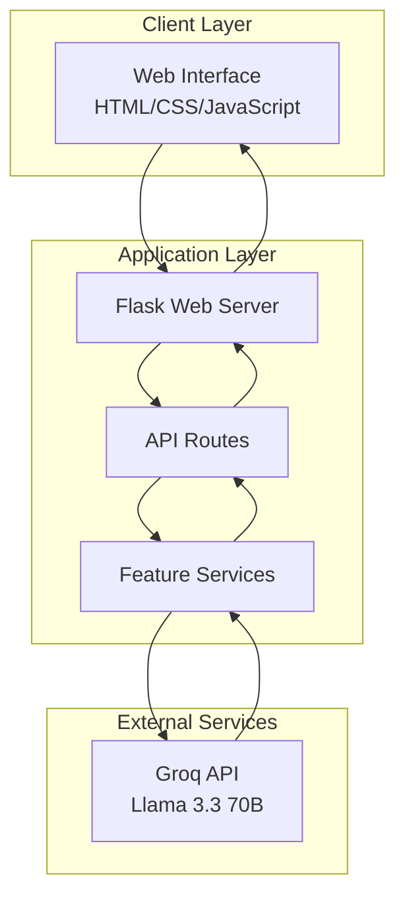

# Design Document: LearnAI Platform

## Overview

LearnAI is a Flask-based web application that provides AI-powered learning and developer productivity tools. The platform integrates with the Groq API using the Llama 3.3 70B model to deliver intelligent responses across seven core features. The architecture follows a single-page application (SPA) pattern with a Python Flask backend serving both API endpoints and static content.

The system is designed for educational use, targeting developers, students, and learners who need AI assistance for code understanding, debugging, documentation, content processing, and personalized learning. The platform emphasizes user experience through a modern dark-themed interface, robust error handling, and responsive design.

## Architecture

### High-Level Architecture



### System Architecture Principles

1. **Single-Page Application**: All functionality accessible through one web interface
2. **RESTful API Design**: Clean separation between frontend and backend through well-defined endpoints
3. **External AI Integration**: Leverages Groq API for all AI processing rather than local models
4. **Stateless Design**: Each request is independent, enabling scalability
5. **Error Resilience**: Comprehensive error handling with retry logic for external API calls

### Technology Stack

- **Backend Framework**: Flask (Python) - lightweight and flexible web framework
- **Frontend**: Vanilla HTML/CSS/JavaScript - simple, fast, and maintainable
- **AI Provider**: Groq API with Llama 3.3 70B model - high-performance language model
- **HTTP Client**: Python requests library with retry logic
- **Deployment**: Web server compatible (designed for hackathon deployment)

## Components and Interfaces

### Core Components

#### 1. Flask Application Server
- **Purpose**: Main application entry point and request routing
- **Responsibilities**: 
  - Serve static files (HTML, CSS, JavaScript)
  - Route API requests to appropriate handlers
  - Handle CORS and security headers
  - Provide health check endpoints

#### 2. Feature Service Layer
Each AI feature is implemented as a separate service module:

- **CodeExplainerService**: Processes code explanation requests
- **AITutorService**: Handles personalized tutoring interactions
- **DebugHelperService**: Manages code debugging assistance
- **DocumentationGeneratorService**: Creates professional documentation
- **ContentSummarizerService**: Processes text summarization with style options
- **LearningPathGeneratorService**: Generates personalized learning roadmaps
- **ChatAssistantService**: Manages conversational AI interactions

#### 3. Groq API Client
- **Purpose**: Interface with external Groq API
- **Responsibilities**:
  - Format requests according to Groq API specifications
  - Handle authentication and rate limiting
  - Implement retry logic for transient failures
  - Parse and validate API responses

#### 4. Web Interface
- **Purpose**: User interaction layer
- **Components**:
  - Feature selection interface
  - Input forms for each feature type
  - Response display areas
  - Loading states and error messaging
  - Responsive layout system

### API Interface Design

#### Endpoint Structure
```
POST /api/explain-code
POST /api/ai-tutor
POST /api/debug-help
POST /api/generate-docs
POST /api/summarize
POST /api/learning-path
POST /api/chat
GET /health
```

#### Request/Response Format
All API endpoints follow a consistent JSON format:

**Request Format:**
```json
{
  "input": "user input content",
  "options": {
    "style": "optional style parameter",
    "level": "optional difficulty level"
  }
}
```

**Response Format:**
```json
{
  "success": true,
  "result": "AI-generated response",
  "error": null,
  "metadata": {
    "processing_time": 1.23,
    "model_used": "llama-3.3-70b"
  }
}
```

**Error Response Format:**
```json
{
  "success": false,
  "result": null,
  "error": {
    "message": "Error description",
    "code": "ERROR_CODE",
    "retry_after": 30
  }
}
```

### Integration Patterns

#### Groq API Integration
- **Authentication**: API key-based authentication
- **Rate Limiting**: Exponential backoff retry strategy
- **Error Handling**: Comprehensive error categorization and user-friendly messaging
- **Request Optimization**: Efficient prompt engineering for each feature type

#### Frontend-Backend Communication
- **Asynchronous Requests**: All API calls use async/await pattern
- **Loading States**: Visual feedback during processing
- **Error Display**: User-friendly error messages with retry options
- **Response Streaming**: Future consideration for long responses

## Data Models

### Request Models

#### BaseRequest
```python
class BaseRequest:
    input: str          # User input content
    timestamp: datetime # Request timestamp
    feature_type: str   # Type of AI feature requested
```

#### CodeExplanationRequest(BaseRequest)
```python
class CodeExplanationRequest(BaseRequest):
    language: Optional[str]     # Programming language hint
    complexity_level: str       # beginner, intermediate, advanced
```

#### TutoringRequest(BaseRequest)
```python
class TutoringRequest(BaseRequest):
    topic: str                  # Subject matter
    learning_style: str         # visual, auditory, kinesthetic, reading
    current_level: str          # beginner, intermediate, advanced
```

#### DebuggingRequest(BaseRequest)
```python
class DebuggingRequest(BaseRequest):
    error_message: Optional[str] # Error message if available
    language: Optional[str]      # Programming language
    context: Optional[str]       # Additional context
```

#### DocumentationRequest(BaseRequest)
```python
class DocumentationRequest(BaseRequest):
    doc_type: str               # API, README, inline, technical
    language: Optional[str]     # Programming language
```

#### SummarizationRequest(BaseRequest)
```python
class SummarizationRequest(BaseRequest):
    summary_style: str          # concise, detailed, eli5, actionable
    target_length: Optional[int] # Desired summary length
```

#### LearningPathRequest(BaseRequest)
```python
class LearningPathRequest(BaseRequest):
    goal: str                   # Learning objective
    timeframe: Optional[str]    # Available time commitment
    current_knowledge: str      # Current skill level
```

#### ChatRequest(BaseRequest)
```python
class ChatRequest(BaseRequest):
    conversation_id: Optional[str] # For maintaining context
    message_type: str             # question, followup, clarification
```

### Response Models

#### BaseResponse
```python
class BaseResponse:
    success: bool
    result: Optional[str]
    error: Optional[ErrorInfo]
    metadata: ResponseMetadata
    timestamp: datetime
```

#### ErrorInfo
```python
class ErrorInfo:
    message: str                # User-friendly error message
    code: str                   # Error classification code
    retry_after: Optional[int]  # Seconds to wait before retry
    details: Optional[str]      # Technical details for debugging
```

#### ResponseMetadata
```python
class ResponseMetadata:
    processing_time: float      # Response generation time
    model_used: str            # AI model identifier
    tokens_used: Optional[int] # Token consumption (if available)
    feature_type: str          # Which feature generated the response
```

### Configuration Models

#### GroqConfig
```python
class GroqConfig:
    api_key: str
    base_url: str
    model_name: str             # llama-3.3-70b-versatile
    max_tokens: int
    temperature: float
    timeout: int
    max_retries: int
    retry_delay: float
```

#### FeatureConfig
```python
class FeatureConfig:
    enabled: bool
    rate_limit: int             # Requests per minute
    max_input_length: int
    timeout: int
    custom_prompts: Dict[str, str]
```

### Data Validation Rules

1. **Input Sanitization**: All user inputs are sanitized to prevent injection attacks
2. **Length Limits**: Maximum input lengths enforced per feature type
3. **Content Filtering**: Basic content filtering for inappropriate material
4. **Rate Limiting**: Per-IP rate limiting to prevent abuse
5. **Authentication**: API key validation for Groq API access

## Correctness Properties

*A property is a characteristic or behavior that should hold true across all valid executions of a system—essentially, a formal statement about what the system should do. Properties serve as the bridge between human-readable specifications and machine-verifiable correctness guarantees.*

### Property 1: Code Explanation Quality
*For any* valid code input, the Code_Explainer should generate a response that contains beginner-friendly language patterns and step-by-step breakdown elements
**Validates: Requirements 1.1, 1.2**

### Property 2: Code Concept Coverage
*For any* code containing multiple programming concepts, the Code_Explainer should address each major concept separately in the explanation
**Validates: Requirements 1.3**

### Property 3: Invalid Code Feedback
*For any* malformed or invalid code input, the Code_Explainer should provide helpful feedback about the specific issues rather than generic error messages
**Validates: Requirements 1.4**

### Property 4: Tutoring Style Adaptation
*For any* tutoring topic and learning style combination, the AI_Tutor should generate responses that differ appropriately based on the specified learning style (visual, auditory, kinesthetic, reading)
**Validates: Requirements 2.2**

### Property 5: Complex Topic Segmentation
*For any* complex topic request, the AI_Tutor should break down the response into digestible segments with clear organization
**Validates: Requirements 2.3, 2.5**

### Property 6: Debug Error Identification
*For any* code containing known errors, the Debug_Helper should identify the issues and provide clear descriptions of what went wrong
**Validates: Requirements 3.1, 3.2**

### Property 7: Debug Solution Provision
*For any* debugging request, the Debug_Helper should provide specific, actionable solutions with explanatory reasoning for why the fixes will work
**Validates: Requirements 3.3, 3.5**

### Property 8: Multiple Error Handling
*For any* code containing multiple errors, the Debug_Helper should address them systematically rather than focusing on only one issue
**Validates: Requirements 3.4**

### Property 9: Documentation Structure Analysis
*For any* code input, the Documentation_Generator should demonstrate understanding of the code structure in the generated documentation
**Validates: Requirements 4.1**

### Property 10: Documentation Standard Compliance
*For any* code documentation request, the Documentation_Generator should produce output that follows standard documentation patterns and includes required elements (parameters, return values, examples for functions/classes)
**Validates: Requirements 4.2, 4.3**

### Property 11: Documentation Hierarchy
*For any* complex codebase, the Documentation_Generator should organize the documentation in a logical hierarchical structure
**Validates: Requirements 4.4**

### Property 12: Summarization Style Variation
*For any* text input and summary style combination (concise, detailed, ELI5, actionable), the Content_Summarizer should produce appropriately different outputs that match the requested style characteristics
**Validates: Requirements 5.2, 5.3**

### Property 13: Summarization Length Reduction
*For any* long text input, the Content_Summarizer should produce a summary that is significantly shorter than the original while maintaining key information
**Validates: Requirements 5.4**

### Property 14: Learning Path Structure
*For any* learning topic request, the Learning_Path_Generator should create a structured roadmap with sequential elements showing progression from basic to advanced concepts
**Validates: Requirements 6.1, 6.2**

### Property 15: Learning Path Metadata
*For any* learning path generation, the output should include milestone/checkpoint elements, timeframe estimates, and difficulty level information
**Validates: Requirements 6.3, 6.4**

### Property 16: Learning Path Personalization
*For any* topic and knowledge level combination, the Learning_Path_Generator should produce different recommendations based on the specified current knowledge level
**Validates: Requirements 6.5**

### Property 17: Educational Chat Responses
*For any* learning-related question, the AI_Chat_Assistant should provide responses that contain educational content patterns appropriate to the query
**Validates: Requirements 7.3**

### Property 18: Productivity Solution Responses
*For any* productivity-related question, the AI_Chat_Assistant should provide solution-oriented responses with practical advice
**Validates: Requirements 7.4**

### Property 19: Clarification for Ambiguous Queries
*For any* ambiguous or unclear input, the AI_Chat_Assistant should respond with clarifying questions to better understand the user's intent
**Validates: Requirements 7.5**

### Property 20: Rate Limit Retry Logic
*For any* API rate limit response, the system should implement retry attempts with appropriate exponential backoff delays
**Validates: Requirements 8.1**

### Property 21: Error Handling and Feedback
*For any* network error or invalid input, the system should provide clear, helpful error messages and maintain user experience
**Validates: Requirements 8.2, 8.3, 8.4**

### Property 22: Input Validation
*For any* user input that violates system constraints (length, format, content), the system should reject the input with specific, helpful feedback
**Validates: Requirements 8.3**

### Property 23: Responsive Design Elements
*For any* screen size variation, the interface should contain responsive design elements (media queries, flexible layouts) that adapt appropriately
**Validates: Requirements 9.2**

### Property 24: Processing Status Feedback
*For any* request processing state, the system should provide visual feedback indicating the current status to the user
**Validates: Requirements 9.4**

### Property 25: Response Formatting
*For any* feature response, the output should contain proper formatting elements (line breaks, headers, structure) for optimal readability
**Validates: Requirements 1.5, 4.5, 9.5**

### Property 26: Health Check Availability
*For any* system health check request, the platform should return appropriate status information and key metrics
**Validates: Requirements 10.2**

### Property 27: Performance Monitoring
*For any* system operation, response times and error rates should be tracked and available for monitoring
**Validates: Requirements 10.4**

### Property 28: Diagnostic Logging
*For any* system issue or error condition, appropriate diagnostic information should be logged for troubleshooting
**Validates: Requirements 10.3**

## Error Handling

### Error Categories and Responses

#### 1. External API Errors (Groq API)
- **Rate Limiting**: Implement exponential backoff with jitter (1s, 2s, 4s, 8s delays)
- **Authentication Errors**: Log securely and return generic "service unavailable" message
- **Timeout Errors**: Retry up to 3 times with increasing timeouts (10s, 20s, 30s)
- **Service Unavailable**: Provide clear message with estimated recovery time

#### 2. Input Validation Errors
- **Length Violations**: Specify maximum allowed length and current input length
- **Format Errors**: Provide examples of correct format
- **Content Filtering**: Generic message about content policy without specifics
- **Encoding Issues**: Attempt UTF-8 conversion with fallback to error message

#### 3. System Errors
- **Memory Issues**: Graceful degradation with simplified processing
- **File System Errors**: Log details but return generic error to user
- **Configuration Errors**: Fail fast during startup with clear admin messages
- **Database Errors**: Retry transient errors, fail permanently for schema issues

#### 4. User Experience Error Handling
- **Progressive Error Disclosure**: Start with simple message, offer "more details" option
- **Retry Mechanisms**: Automatic retry for transient errors, manual retry button for others
- **Fallback Responses**: Provide basic functionality when advanced features fail
- **Error Context**: Include request ID for support purposes

### Error Recovery Strategies

#### Graceful Degradation
1. **Feature Isolation**: Failure in one feature doesn't affect others
2. **Simplified Responses**: Fall back to basic responses when advanced processing fails
3. **Cached Responses**: Serve cached results when external API is unavailable
4. **Manual Overrides**: Admin interface for bypassing failed components

#### Monitoring and Alerting
1. **Error Rate Thresholds**: Alert when error rate exceeds 5% over 5-minute window
2. **Response Time Monitoring**: Alert when 95th percentile exceeds 10 seconds
3. **External Dependency Health**: Monitor Groq API availability and performance
4. **Resource Utilization**: Track memory, CPU, and network usage patterns

## Testing Strategy

### Dual Testing Approach

The LearnAI platform requires both unit testing and property-based testing to ensure comprehensive coverage:

**Unit Tests** focus on:
- Specific examples of each feature's functionality
- Edge cases and error conditions
- Integration points between components
- API endpoint behavior with known inputs
- UI component rendering and interaction

**Property-Based Tests** focus on:
- Universal properties that hold across all inputs
- Comprehensive input coverage through randomization
- AI response quality validation across diverse inputs
- System behavior under various load conditions

### Property-Based Testing Configuration

**Testing Library**: Use Hypothesis (Python) for property-based testing
**Test Configuration**: Minimum 100 iterations per property test
**Test Tagging**: Each property test must reference its design document property

Tag format: **Feature: learn-ai-platform, Property {number}: {property_text}**

### Feature-Specific Testing Strategies

#### AI Feature Testing
- **Response Quality**: Validate that AI responses meet quality criteria (length, structure, relevance)
- **Input Handling**: Test with various input types, lengths, and formats
- **Error Scenarios**: Verify graceful handling of malformed inputs
- **Performance**: Ensure response times meet acceptable thresholds

#### API Testing
- **Endpoint Functionality**: Verify all endpoints return correct response formats
- **Error Handling**: Test various error conditions and response codes
- **Rate Limiting**: Validate retry logic and backoff strategies
- **Authentication**: Test API key validation and security measures

#### UI Testing
- **Responsive Design**: Test interface across different screen sizes
- **User Interactions**: Validate form submissions and navigation
- **Loading States**: Verify visual feedback during processing
- **Error Display**: Test error message presentation and retry functionality

#### Integration Testing
- **End-to-End Flows**: Test complete user journeys through each feature
- **External API Integration**: Validate Groq API communication and error handling
- **Cross-Feature Interactions**: Ensure features work independently without interference
- **Performance Under Load**: Test system behavior with concurrent users

### Test Data Management

#### Synthetic Data Generation
- **Code Samples**: Generate various programming language examples
- **Text Content**: Create diverse text samples for summarization testing
- **Learning Topics**: Develop comprehensive topic lists for tutoring tests
- **Error Scenarios**: Maintain library of common programming errors

#### Test Environment Setup
- **Mock Groq API**: Create mock responses for consistent testing
- **Configuration Management**: Separate test configurations from production
- **Database Seeding**: Populate test data for comprehensive coverage
- **Cleanup Procedures**: Ensure tests don't interfere with each other

### Continuous Testing Strategy

#### Automated Test Execution
- **Pre-commit Hooks**: Run unit tests before code commits
- **CI/CD Pipeline**: Execute full test suite on pull requests
- **Nightly Builds**: Run extended property-based tests with higher iteration counts
- **Performance Regression**: Monitor response times and resource usage trends

#### Quality Metrics
- **Code Coverage**: Maintain >90% line coverage for core functionality
- **Property Test Coverage**: Ensure all design properties have corresponding tests
- **Error Path Coverage**: Verify all error handling paths are tested
- **Performance Benchmarks**: Track response times and resource utilization